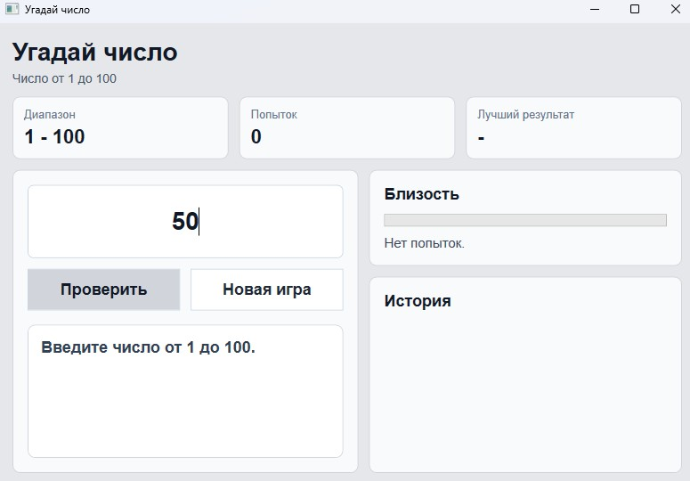
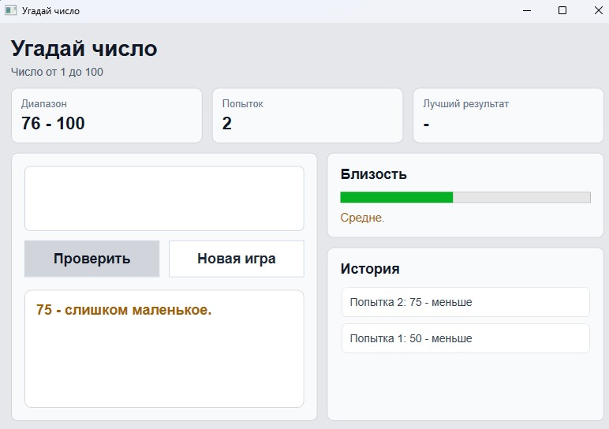
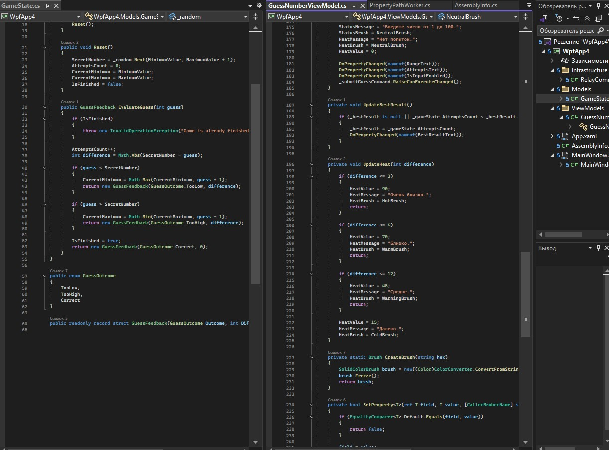

# Лабораторная работа 4. Игра "Угадай число"

Задание: создать WPF-приложение с игрой "Угадай число", привязкой данных, проверкой ввода и возможностью начать игру заново.

Проект построен по схеме MVVM. Главное окно `WpfApp4/MainWindow.xaml` содержит поле ввода, кнопки `Проверить` и `Новая игра`, блоки статистики, историю попыток и индикатор близости. Контекст данных задается в `MainWindow.xaml.cs` через `GuessNumberViewModel`.

Модель `GameState` хранит загаданное число, диапазон и количество попыток. Метод `EvaluateGuess` сравнивает введенное число с загаданным, увеличивает счетчик попыток и сужает диапазон подсказки. ViewModel проверяет ввод, обновляет сообщение, историю и свойства, связанные с интерфейсом.

Фишкой проекта является радар близости. Метод `UpdateHeat` преобразует расстояние до загаданного числа в значение `HeatValue`, текст подсказки и цвет. В интерфейсе это отображается через `ProgressBar`, поэтому видно, насколько близка текущая попытка. Новая партия запускается без перезапуска программы командой `RestartGameCommand`, которая вызывает `RestartGame` и сбрасывает состояние игры.

Снимок 1: начальное состояние игры.

Снимок 2: неверная попытка, обновленный диапазон, история и индикатор близости.

Снимок 3: фрагменты `GameState.Evaluate` и `GuessNumberViewModel`.
